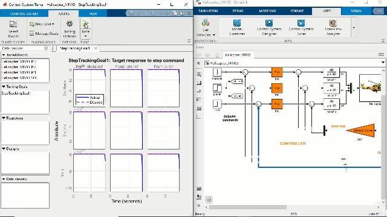

# INS Navigation System -- MATLAB/Simulink Simulation

> Original MATLAB/Simulink prototype for the NavCore-Pixhawk INS navigation system.
> This simulation environment was used to prototype, validate, and tune the EKF algorithms before porting to Python for embedded deployment on the Raspberry Pi 4.

---

## Overview

This folder contains the high-fidelity MATLAB/Simulink simulation that serves as the foundation for the NavCore-Pixhawk real-time INS. The simulation implements a 15-state Extended Kalman Filter with Euler angle attitude representation, synthetic trajectory generation, and noisy IMU/barometer/magnetometer measurement simulation.

> **Note**: The production system (NavCore-Pixhawk) has since migrated to a 16-state Error-State Quaternion EKF (`eskf_core.py`) which eliminates the gimbal lock limitation of this Euler-based prototype. The MATLAB code is retained for reference and educational purposes.

---

## Simulation Results

### INS Trajectory and Pose Error Analysis

Four-panel analysis comparing INS estimation methods: (a) 3D flight trajectories for true data, proposed EKF, VINS, and VIO-VIS; (b) per-axis (X/Y/Z) position tracking over 80 seconds; (c) roll, pitch, and yaw attitude estimation errors; (d) Absolute Pose Error (APE) with RMSE of approximately 0.06 m using Sim(3) Umeyama alignment. Demonstrates sub-decimetre accuracy for the proposed EKF approach.


### Azimuth Angle Error Comparison

Relative azimuth angle error over 8000 seconds comparing three estimation approaches: graph optimization (orange), Kalman filter (teal), and data link results (gold). All methods maintain error within +/- 0.01 radians (0.57 degrees). The filter results show the smoothest response with least high-frequency noise, validating the EKF's heading estimation stability for long-duration flights.


### MATLAB/Simulink Control System Design

Split-panel view of the MATLAB Control System Tuner and Simulink model. Left panel shows step-tracking goal responses for the MIMO UAV controller with actual vs desired response across multiple channels. Right panel displays the full Simulink block diagram including the plant model, PID subsystem controller, and feedback loop architecture. This MATLAB model served as the prototype for the Python EKF implementation.



### Simulink Drone Control Block Diagram


### UAV Animation and Visualization


### Control Model Architecture


---

## Source Files

| File | Description |
|---|---|
| `main_ins_navigation.m` | Simulation entry point and main loop |
| `ekf_core.m` | 15-state EKF implementation (Euler angles) |
| `generate_trajectory.m` | Synthetic flight path generator (climb, figure-8, banked turn, descent) |
| `simulate_imu.m` | Noisy IMU measurement simulator with configurable noise profiles |
| `dead_reckon.m` | Dead-reckoning baseline for performance comparison |
| `imu_noise_params.m` | Sensor noise configuration (ICM-42688-P, MS5611, RM3100 datasheets) |
| `plot_results.m` | Post-simulation plotting (3D trajectory, per-axis errors, covariance) |
| `benchmark_performance.m` | Performance benchmarking (RMSE, processing rate, drift comparison) |
| `run_unit_tests.m` | MATLAB unit test suite |
| `system_architecture.md` | Detailed EKF math documentation (state propagation, Jacobians, sensor models) |

---

## Running the Simulation

```matlab
% Open MATLAB and navigate to the simulation_source/ folder
cd('simulation_source')

% Run the full simulation
main_ins_navigation

% Run the benchmark
benchmark_performance

% Run unit tests
run_unit_tests
```

---

## System Architecture

The simulation implements a loosely-coupled INS with:

- **State Vector**: `x = [px, py, pz, vx, vy, vz, phi, theta, psi, ba_x, ba_y, ba_z, bg_x, bg_y, bg_z]`
- **Coordinate Frame**: NED (North-East-Down)
- **Rotation Convention**: ZYX aerospace (Yaw, Pitch, Roll)
- **Measurement Updates**: Barometric altitude + magnetometer yaw with innovation gating

For the full mathematical derivation, see [system_architecture.md](simulation_source/system_architecture.md).

---

## Simulation Validation Results

| Metric | Value |
|---|---|
| Position RMSE | 0.4 -- 0.8 m |
| Yaw RMSE | < 1.5 deg |
| Processing rate | > 7000 Hz (on desktop) |
| Drift improvement over DR | ~14% |

> **Important**: These results are from simulation only. They represent the theoretical best-case performance of the EKF with synthetic noise. Real-flight accuracy depends on sensor calibration, vibration environment, and environmental conditions. The production system includes `ground_truth_eval.py` for computing APE/RPE against real ground truth (RTK GPS / AprilTag).

---

## Relationship to Production Code

| MATLAB (Simulation) | Python (Production) | Key Difference |
|---|---|---|
| `ekf_core.m` | `eskf_core.py` | Euler angles replaced with quaternions |
| `main_ins_navigation.m` | `main_ins_navigation.py` | Added MAVLink, safety, timing |
| `imu_noise_params.m` | `imu_noise_params.py` + `config_loader.py` | Added YAML config + schema validation |
| `dead_reckon.m` | `dead_reckon.py` | Identical algorithm |
| `benchmark_performance.m` | `benchmark_sitl.py` | Added failure scenario testing |
| `run_unit_tests.m` | `test_ins.py` + `test_failure_scenarios.py` | Added covariance, quaternion, Jacobian tests |

---

## References

1. Groves, P.D. (2013). *Principles of GNSS, Inertial, and Multisensor Integrated Navigation Systems*.
2. Farrell, J.A. (2008). *Aided Navigation: GPS with High Rate Sensors*.
3. Kalman, R.E. (1960). A New Approach to Linear Filtering and Prediction Problems.

---

## Author

**ARYA MGC**

Original MATLAB simulation: [ins-system-for-drone](https://github.com/ARYA-mgc/ins-system-for-drone)
