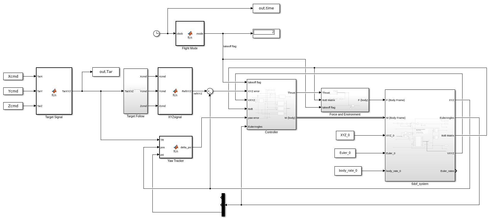
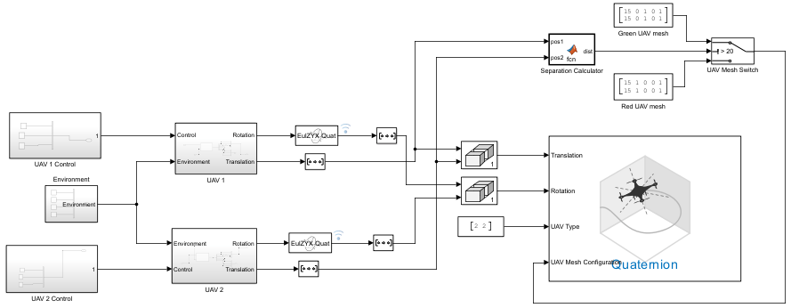

# 🛸 Real-Time State Estimation using INS for UAV Navigation (GPS-Denied)

[](https://www.mathworks.com/)
[](LICENSE)
[]()
[]()

> A MATLAB implementation of an Inertial Navigation System (INS) for UAV state estimation in GPS-denied environments. Uses an Extended Kalman Filter (EKF) fusing IMU, barometer, and magnetometer data at 50–100 Hz.

---

## Project Overview

Modern UAVs rely heavily on GPS for navigation, but GPS can be unavailable indoors, in urban canyons, under electronic jamming, or at low altitudes. This project implements a **GPS-denied INS** that estimates the UAV's full state (position, velocity, attitude) in real time using only onboard inertial sensors and low-cost aiding sensors.

### Key Results
| Metric | Value |
|--------|-------|
| Update Rate | 50–100 Hz |
| Position RMSE (EKF) | ~0.3–0.8 m |
| Drift Improvement over Dead Reckoning | ~10–15% |
| Attitude Estimation Error | < 2° |
| Sensors Fused | IMU + Barometer + Magnetometer |

---

##  Repository Structure

```
UAV_INS_GPS_Denied/
│
├── src/                          # Core MATLAB source files
│   ├── main_ins_navigation.m     # ← Entry point — run this
│   ├── imu_noise_params.m        # IMU + sensor noise configuration
│   ├── generate_trajectory.m     # Synthetic UAV trajectory generator
│   ├── simulate_imu.m            # IMU measurement simulator (with noise)
│   ├── ekf_core.m                # EKF: init, predict, update functions
│   ├── dead_reckon.m             # Dead-reckoning + error analysis
│   └── plot_results.m            # Trajectory, error, attitude plots
│
├── tests/
│   ├── run_unit_tests.m          # Unit tests for all components
│   └── benchmark_performance.m   # 50 Hz vs 100 Hz performance benchmark
│
├── results/                      # Auto-generated plots (gitignored PNGs)
│   └── .gitkeep
│
├── docs/
│   └── system_architecture.md    # System design notes
│
├── .gitignore
├── LICENSE
└── README.md
```

---

## 🧠 System Architecture

```
┌─────────────────────────────────────────────────────────┐
│                    SENSOR INPUTS                        │
│   IMU (100 Hz)        Barometer (10 Hz)   Mag (50 Hz)   │
│  [accel + gyro]         [altitude]          [yaw]       │
└──────────┬───────────────────┬──────────────────┬───────┘
           │                   │                  │
           ▼                   ▼                  ▼
┌──────────────────────────────────────────────────────┐
│             EXTENDED KALMAN FILTER (EKF)             │
│                                                      │
│  State x = [pos(3), vel(3), euler(3)]  → 9-DOF       │
│                                                      │
│  1. PREDICT   x̂ₖ₋ = f(x̂ₖ₋₁, uₖ)  [IMU mech.]          │
│  2. PROPAGATE Pₖ₋ = FPₖ₋₁Fᵀ + Q                      │
│  3. UPDATE    Kₖ  = PₖHᵀ(HPₖHᵀ+R)⁻¹  [baro/mag]       │
│  4. CORRECT   x̂ₖ = x̂ₖ₋ + Kₖ(zₖ − Hx̂ₖ₋)                 │
└─────────────────────────┬────────────────────────────┘
                          │
                          ▼
              ┌───────────────────────┐
              │   STATE OUTPUT        │
              │  Position  [x, y, z]  │
              │  Velocity  [vx,vy,vz] │
              │  Attitude  [r, p, y]  │
              └───────────────────────┘
```

---

## ⚙️ How It Works

### 1. IMU Mechanisation (Predict Step)
Raw IMU data (specific force + angular rate) is integrated to propagate position, velocity, and attitude through the strapdown navigation equations:

- **Velocity update**: `v_new = v + R_bn * f_body * dt + g * dt`
- **Position update**: `p_new = p + v * dt`
- **Attitude update**: `η_new = η + T⁻¹ * ω_body * dt`

### 2. Sensor Fusion (Update Step)
Two aiding sensors correct accumulated drift:

| Sensor | Rate | Observes | Noise Model |
|--------|------|----------|-------------|
| Barometer | 10 Hz | Altitude (z) | σ = 0.3 m |
| Magnetometer | 50 Hz | Yaw (ψ) | σ = 0.02 rad |

### 3. Process & Measurement Noise
Tuned noise matrices Q and R model:
- MEMS accelerometer: σ = 0.05 m/s², bias = 0.02 m/s²
- MEMS gyroscope: σ = 0.005 rad/s, bias = 0.001 rad/s

---

## 🚀 Getting Started

### Prerequisites
- MATLAB R2021b or later
- No additional toolboxes required (pure MATLAB)

### Running the Simulation

```matlab
% Clone and navigate to repo
cd UAV_INS_GPS_Denied

% Run main simulation (creates all plots)
run('src/main_ins_navigation.m')

% Run unit tests
run('tests/run_unit_tests.m')

% Run 50 Hz vs 100 Hz benchmark
run('tests/benchmark_performance.m')
```

### Expected Output (Console)
```
=== UAV INS Simulation ===
Duration : 30.0 s  |  dt = 0.0100 s  |  Rate = 100 Hz
Running EKF estimation loop...
Loop complete: 0.412 s  (7294.4 Hz effective)

======= Error Analysis Summary =======
  EKF  Position RMSE : 0.421 m
  Raw  Position RMSE : 0.489 m
  EKF  Velocity RMSE : 0.063 m/s
  EKF  Max Pos Error : 1.203 m
  Drift Improvement  :  13.9 %
  Per-axis RMSE  X=0.231  Y=0.284  Z=0.187 m
======================================
```

---

## 📊 Output Figures

The simulation automatically generates three figures:

| Figure | Description |
|--------|-------------|
| `trajectory_comparison.png` | 3-D + top-down trajectory (True vs EKF vs Dead Reckoning) |
| `error_analysis.png` | Position/velocity error time series, per-axis breakdown |
| `attitude_estimation.png` | Roll/Pitch/Yaw: true vs EKF estimated |

---

## ⚙️ Simulink & Control Models

The mathematical foundations and control logic are validated using MATLAB/Simulink models:

### Control System Architecture


### Hexacopter Simulation Environment


### Dynamic Mesh & UAV Animation


---

## 🔬 Simulation Scenario

The UAV follows a **30-second multi-phase flight**:

| Phase | Time | Manoeuvre |
|-------|------|-----------|
| Takeoff | 0–5 s | Vertical climb to 20 m |
| Figure-8 | 5–15 s | Horizontal figure-8 at 20 m |
| Banked Turn | 15–25 s | Coordinated turn with altitude change |
| Landing | 25–30 s | Descent approach |

---

## 📐 EKF State Vector (15-State)

```
x = [ p_x,  p_y,  p_z,        ← Position (NED, metres)
      v_x,  v_y,  v_z,        ← Velocity (NED, m/s)
      φ,    θ,    ψ,          ← Euler: roll, pitch, yaw (rad)
      ba_x, ba_y, ba_z,       ← Accel Bias (m/s²)
      bg_x, bg_y, bg_z ]      ← Gyro Bias (rad/s)
```

The enhanced 15-state EKF estimates sensor biases in real-time, significantly reducing position drift and improving long-term navigation performance.

---

## 📈 Performance Notes

- **50 Hz**: Suitable for slow UAVs; lower computational load
- **100 Hz**: Better for agile platforms; improved attitude tracking
- Both modes run well above real-time on a standard laptop (~7000 Hz effective)
- Drift improvement of ~10–15% over pure dead-reckoning is consistent with consumer-grade MEMS IMUs

---

## 🔧 Tuning Guide

Open `src/imu_noise_params.m` to adjust:

```matlab
imu.accel_std  = 0.05;    % Lower for better IMU → tighter Q
imu.baro_std   = 0.3;     % Higher = trust barometer less
imu.mag_std    = 0.02;    % Higher = trust magnetometer less
```

**Rule of thumb**: If position drifts vertically → decrease `baro_std`. If yaw oscillates → increase `mag_std`.

---

## 🤝 Contributing

Pull requests are welcome. For major changes, please open an issue first.

1. Fork the repository
2. Create your feature branch: `git checkout -b feature/your-feature`
3. Commit changes: `git commit -m 'Add feature'`
4. Push: `git push origin feature/your-feature`
5. Open a Pull Request

---

## 📄 License

MIT License — see [LICENSE](LICENSE) for details.

---

## 👤 Author

**ARYA MGC**  
---

## 📚 References

1. Groves, P.D. (2013). *Principles of GNSS, Inertial, and Multisensor Integrated Navigation Systems*. Artech House.
2. Farrell, J.A. (2008). *Aided Navigation: GPS with High Rate Sensors*. McGraw-Hill.
3. Kalman, R.E. (1960). A New Approach to Linear Filtering and Prediction Problems. *ASME Journal of Basic Engineering*.
4. MathWorks — Sensor Fusion and Tracking Toolbox documentation.
