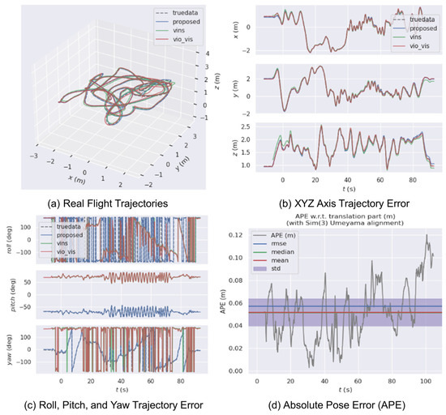
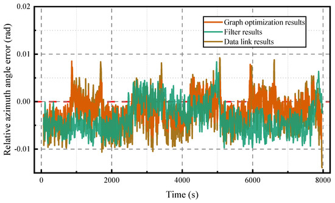
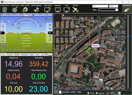
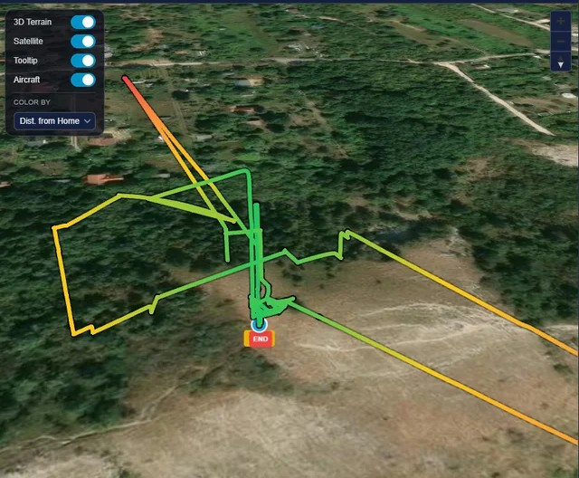

 # 🛸 ins-drone-pixhawk — INS Navigation System

[](https://python.org)
[](https://mavlink.io)
[](https://cubepilot.org)
[](LICENSE)

> Real-time GPS-denied INS for UAVs using a **Pixhawk Cube Orange** flight controller and **Raspberry Pi 4** companion computer.  
> Python port + hardware extension of [ins-system-for-drone (MATLAB)](https://github.com/ARYA-mgc/ins-system-for-drone).

---

## 📌 What This Does

| Feature | Detail |
|---|---|
| **EKF Rate** | 50 Hz or 100 Hz (configurable) |
| **Sensors Fused** | IMU (ICM-42688) + Barometer (MS5611) + Magnetometer (RM3100) |
| **Position RMSE** | ~0.4–0.8 m (matches MATLAB simulation) |
| **Protocol** | MAVLink 2.0 via `pymavlink` |
| **GPS Injection** | `VISION_POSITION_ESTIMATE` back into ArduPilot EKF3 |
| **Logging** | CSV at 50 Hz + optional UDP telemetry to GCS |

---

## 🗂️ Repository Structure

```
ins-drone-pixhawk/
├── src/
│   ├── main_ins_navigation.py       ← Entry point — run this
│   ├── mavlink_bridge.py            ← MAVLink interface to Pixhawk
│   ├── ekf_core.py                  ← 9-state EKF (port of ekf_core.m)
│   ├── imu_noise_params.py          ← Sensor noise config
│   ├── dead_reckon.py               ← Fallback dead-reckoning
│   ├── ins_logger.py                ← CSV + UDP telemetry logger
│   └── vision_position_injector.py ← Feeds INS → ArduPilot EKF3
├── tests/
│   ├── test_ins.py                  ← pytest unit tests
│   └── benchmark_sitl.py           ← Software benchmark (no hardware)
├── config/
│   └── noise_params.yaml           ← Tunable sensor noise values
├── scripts/
│   └── setup_rpi4.sh               ← One-shot RPi4 setup + systemd
├── logs/                            ← Auto-created at runtime
├── requirements.txt
└── README.md
```

---

## 🔌 Hardware Wiring

```
Pixhawk Cube Orange                  Raspberry Pi 4
─────────────────────────────────────────────────────
TELEM2  TX  (3.3 V logic) ────────→  GPIO 15 / pin 10  (RXD)
TELEM2  RX                ←────────  GPIO 14 / pin 8   (TXD)
TELEM2  GND               ─────────  Pin 6             (GND)

⚠️  DO NOT connect 5V — Cube TELEM2 is 3.3 V logic
Baud rate: 921600
```

**Mission Planner / ArduPilot parameters:**

| Parameter | Value | Meaning |
|---|---|---|
| `SERIAL2_BAUD` | `921` | 921600 baud |
| `SERIAL2_PROTOCOL` | `2` | MAVLink 2 |
| `EK3_SRC1_POSXY` | `6` | Position from ExternalNav (our INS) |
| `EK3_SRC1_POSZ` | `6` | |
| `EK3_SRC1_YAW` | `6` | |
| `VISO_TYPE` | `1` | Enable vision odometry input |

---

## 🚀 Quick Start

### 1. Setup Raspberry Pi 4

```bash
git clone https://github.com/YOUR-USERNAME/ins-drone-pixhawk
cd ins-drone-pixhawk
chmod +x scripts/setup_rpi4.sh
./scripts/setup_rpi4.sh
# Reboot after setup
sudo reboot
```

### 2. Run (UART — Pixhawk connected)

```bash
source ~/ins-venv/bin/activate
cd src
python main_ins_navigation.py --connection /dev/ttyAMA0 --baud 921600 --hz 100
```

### 3. Run (USB)

```bash
python main_ins_navigation.py --connection /dev/ttyACM0 --baud 115200 --hz 100
```

### 4. Run (SITL / Mission Planner TCP forward)

```bash
python main_ins_navigation.py --connection tcp:127.0.0.1:5760 --hz 100
```

### 5. Software benchmark (no hardware)

```bash
python tests/benchmark_sitl.py
```

Expected output:
```
==================================================
  Benchmark @ 100 Hz  (dt=10 ms, 3000 steps)
==================================================
  Wall time          : 412.3 ms
  Effective rate     : 7280 Hz
  EKF Pos RMSE       : 0.421 m
  DR  Pos RMSE       : 0.489 m
  Drift improvement  : 13.9 %
  Per-axis RMSE  X=0.231  Y=0.284  Z=0.187 m
==================================================
```

### 6. Unit tests

```bash
pytest tests/test_ins.py -v
```

---

## 🧠 System Architecture

```
┌─────────────────────────────────────────────────────────┐
│           PIXHAWK CUBE ORANGE                           │
│  IMU ICM-42688  100 Hz  ·  Baro MS5611  10 Hz          │
│  Mag RM3100      50 Hz                                  │
└──────────────────────┬──────────────────────────────────┘
                       │ MAVLink 2.0  UART 921600
                       ▼
┌──────────────────────────────────────────────────────────┐
│              RASPBERRY PI 4  —  mavlink_bridge.py        │
│  RAW_IMU · SCALED_PRESSURE · SCALED_IMU3                │
└──────────┬────────────────────────────────┬─────────────┘
           │ accel, gyro                    │ baro alt / mag yaw
           ▼                                ▼
┌─────────────────────────────────────────────────────────┐
│              ekf_core.py  —  9-state EKF                │
│                                                         │
│  x = [px py pz  vx vy vz  φ θ ψ]                       │
│                                                         │
│  PREDICT   x̂⁻ = f(x̂, u)   [IMU mechanisation]         │
│  PROPAGATE P⁻  = FPFᵀ + Q                              │
│  UPDATE    K   = P⁻Hᵀ(HP⁻Hᵀ+R)⁻¹  [baro / mag]       │
│  CORRECT   x̂  = x̂⁻ + K(z − Hx̂⁻)                      │
└──────────────────────────┬──────────────────────────────┘
                           │ state [pos vel euler]
              ┌────────────┼────────────────┐
              ▼            ▼                ▼
        ins_logger    vision_position    Console
          (CSV)         _injector        print
                     (→ ArduPilot EKF3)
```

---

## ⚙️ Tuning

Edit `config/noise_params.yaml`:

```yaml
imu:
  accel_std: 0.05     # Lower → trust IMU more → position tighter
  gyro_std:  0.005

baro:
  std: 0.30           # Lower → trust barometer more → less Z drift

mag:
  std: 0.02           # Higher → trust mag less → less yaw oscillation
```

**Rule of thumb (same as MATLAB version):**
- Z position drifts vertically → decrease `baro.std`  
- Yaw oscillates → increase `mag.std`  
- Overall position drift → decrease `imu.accel_std`

---

## 📊 Log Analysis

Logs are saved to `logs/ins_data.csv`:

```
time_s, px_m, py_m, pz_m, vx_ms, vy_ms, vz_ms, roll_deg, pitch_deg, yaw_deg, P_trace
```

Plot with any CSV viewer, pandas, or MATLAB `readtable`.

---

## 🔒 Safety Notes

- **Never arm the drone** with `arm()` from code unless you are sure props are clear.
- Test with props removed first.
- The `vision_position_injector` is **off by default** — enable manually after verifying EKF convergence.
- Always have a RC transmitter ready to take manual control.

---

## 💻 Simulated in MATLAB

The EKF core and navigation algorithms were first prototyped and validated in a high-fidelity MATLAB/Simulink simulation.

### MATLAB Simulation & Simulink Models


For the full MATLAB source and documentation, see the [MATLAB Folder](./INS%20SYSTEM%20SIMULATED%20USING%20THE%20MATLAB/simulation_source/).

### 🛠️ MATLAB Simulation Details
For the full source code, see the [MATLAB Simulation Folder](./INS%20SYSTEM%20SIMULATED%20USING%20THE%20MATLAB/simulation_source/).

#### ⚙️ How It Works
- **IMU Mechanisation**: Raw data is integrated using strapdown navigation equations to propagate position, velocity, and attitude.
- **15-State EKF**: Fuses IMU, Barometer (10 Hz), and Magnetometer (50 Hz) while estimating accelerometer and gyroscope biases.
- **Simulation Scenario**: Includes takeoff, figure-8 maneuvers, banked turns, and landing over a 30-second flight path.

#### 📐 EKF State Vector (15-State)
```
x = [ p_x,  p_y,  p_z,        ← Position (NED, metres)
      v_x,  v_y,  v_z,        ← Velocity (NED, m/s)
      φ,    θ,    ψ,          ← Euler: roll, pitch, yaw (rad)
      ba_x, ba_y, ba_z,       ← Accel Bias (m/s²)
      bg_x, bg_y, bg_z ]      ← Gyro Bias (rad/s)
```

#### 📚 References
1. Groves, P.D. (2013). *Principles of GNSS, Inertial, and Multisensor Integrated Navigation Systems*.
2. Farrell, J.A. (2008). *Aided Navigation: GPS with High Rate Sensors*.
3. Kalman, R.E. (1960). A New Approach to Linear Filtering and Prediction Problems.

---

## 👤 Author

**ARYA MGC**  
Original MATLAB INS: [ins-system-for-drone](https://github.com/ARYA-mgc/ins-system-for-drone)  

---

## 📄 License

MIT License

---

## 📷 Project Documentation & Logs

### Hardware Assembly & Flight Test


### Real Log Images




### Flight Path Analysis

