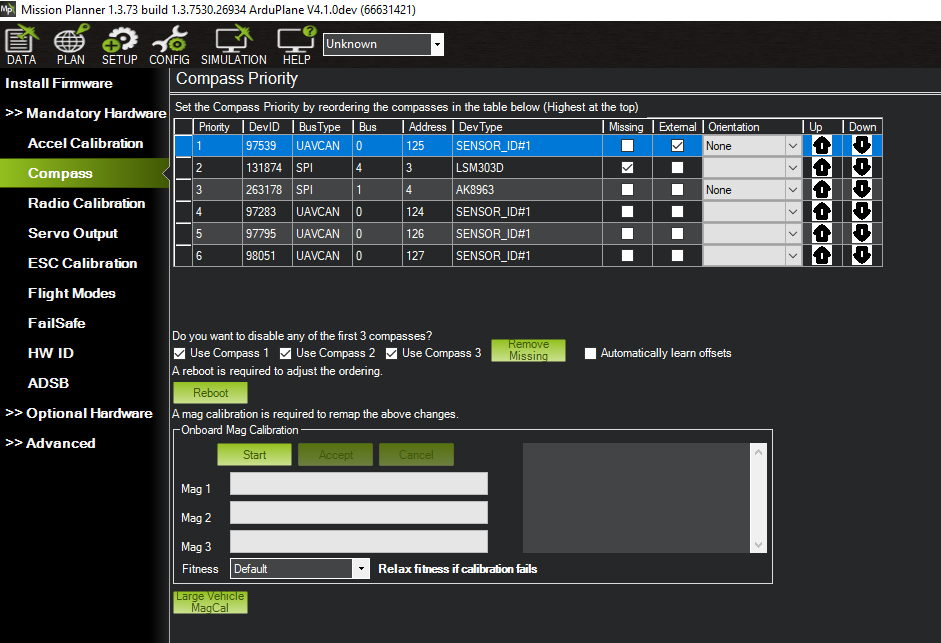

# NavCore-Pixhawk -- GPS-Denied INS Navigation System

[](https://python.org)
[](https://mavlink.io)
[](https://cubepilot.org)
[](LICENSE)

> Real-time GPS-denied INS for UAVs using a **Pixhawk Cube Orange** flight controller and **Raspberry Pi 4** companion computer.  
> Python port + hardware extension of [ins-system-for-drone (MATLAB)](https://github.com/ARYA-mgc/ins-system-for-drone).

---

## Overview

NavCore-Pixhawk implements a tightly-coupled Inertial Navigation System for hexacopter UAVs operating without GPS dependency. The system fuses onboard IMU, barometer, and magnetometer data through a **16-state Error-State Quaternion EKF (ESKF)**, providing continuous position, velocity, attitude, and bias estimates. Filtered navigation states are injected back into ArduPilot's EKF3 as an external navigation source via `VISION_POSITION_ESTIMATE`, enabling autonomous flight in GPS-denied environments.

---

## Key Specifications

| Parameter | Value |
|---|---|
| Estimator | 16-state Error-State Quaternion EKF (ESKF) |
| EKF Rate | 50 Hz / 100 Hz (configurable) |
| Sensors Fused | IMU (ICM-42688) + Barometer (MS5611) + Magnetometer (RM3100) + Optical Flow (optional) |
| Position RMSE | 0.4 -- 0.8 m (**simulation only** -- real-flight validation requires RTK/AprilTag ground truth) |
| Protocol | MAVLink 2.0 via `pymavlink` |
| GPS Injection | `VISION_POSITION_ESTIMATE` into ArduPilot EKF3 |
| Logging | CSV at 50 Hz + structured JSONL + optional UDP telemetry to GCS |
| Safety | Hard velocity/tilt/position-jump limits, automatic vision injection disable on fault |
| Platform | Hexacopter UAV |

---

## Hexacopter Flight Test Video

Live flight test of the hexacopter with NavCore-Pixhawk INS active, validating real-time state estimation performance under actual flight conditions. GPS was enabled during this test solely as a safety fallback and was not used as a navigation input to the INS pipeline.

https://github.com/ARYA-mgc/NavCore-Pixhawk/raw/main/fly%20video%20.mp4

> If the video does not render inline, download [`fly video .mp4`](fly%20video%20.mp4) directly from the repository.

---

## Visual Documentation

### Mission Planner -- Flight Plan Configuration

Five-waypoint autonomous mission configured in Mission Planner GCS over satellite imagery. Waypoints are set at 100 m AGL with computed distances and azimuth bearings between each point. The total mission covers approximately 0.8 km with loiter radius and altitude verification enabled. Connected via COM3 at 115200 baud.


### Compass Calibration -- Onboard Magnetometer Setup

Mission Planner compass priority and onboard magnetometer calibration interface. Six compass sensors detected: primary UAVCAN compass (DevID 97539), SPI-based LSM303D and AK8963, and three additional UAVCAN sensors. The onboard MagCal panel provides per-magnetometer calibration progress bars (Mag 1/2/3) with fitness validation. Proper compass calibration is critical for accurate heading estimation in GPS-denied navigation.



### Hexacopter Hardware Assembly

Carbon-fibre hexacopter frame with Pixhawk Cube Orange flight controller (orange housing, centre-mounted), external GPS/compass module on mast, ESCs with XT60 connectors, and telemetry radio. The companion computer (Raspberry Pi 4) connects via TELEM2 UART for real-time INS data streaming.


### 3D Flight Path Visualization

Post-flight 3D trajectory reconstruction rendered in a satellite-overlay viewer. The colour gradient (green to orange to red) encodes distance from home position. The flight path shows multiple waypoint traversals, loiter patterns, and return-to-launch segments. The END marker indicates the final landing position.


---

## Repository Structure

```
NavCore-Pixhawk/
├── src/
│   ├── main_ins_navigation.py       <- Entry point and system coordinator
│   ├── mavlink_bridge.py            <- MAVLink 2.0 interface to Pixhawk
│   ├── eskf_core.py                 <- 16-state Error-State Quaternion EKF (production)
│   ├── imu_noise_params.py          <- Sensor noise configuration (YAML loader)
│   ├── config_loader.py             <- Strict YAML schema validation (fail-fast)
│   ├── dead_reckon.py               <- Fallback strapdown dead-reckoning
│   ├── time_sync.py                 <- Hardware timestamp synchronization
│   ├── safety_monitor.py            <- Hard velocity/tilt/position-jump limits
│   ├── loop_monitor.py              <- Real-time loop timing and jitter tracking
│   ├── fault_manager.py             <- Sensor dropout handling and mode escalation
│   ├── ins_logger.py                <- CSV + UDP telemetry logger
│   ├── structured_logger.py         <- JSONL structured state/innovation logger
│   ├── vision_position_injector.py  <- Feeds INS state into ArduPilot EKF3
│   ├── adaptive_pid.py              <- Gain-scheduled adaptive PID controller
│   ├── optical_flow_ins.py          <- Optical flow velocity/position estimator
│   ├── allan_variance.py            <- Auto noise tuning from stationary logs
│   ├── log_replay.py                <- Offline JSONL/MAVLink log replay
│   ├── ground_truth_eval.py         <- APE/RPE computation (RTK/AprilTag CSV)
│   ├── ekf_comparison.py            <- ESKF vs EKF3 divergence analysis
│   ├── ekf3_blender.py              <- EKF3 weighted blending (stub)
│   ├── ros2_interface.py            <- Optional ROS2 publisher (stub)
│   ├── vio_pipeline.py              <- VIO pose injection (stub)
│   ├── uwb_fusion.py                <- UWB range fusion (stub)
│   └── slam_interface.py            <- SLAM pose correction (stub)
├── cpp_port/
│   ├── CMakeLists.txt               <- C++17 + Eigen3 portable build
│   ├── include/eskf_core.hpp        <- ESKF types and API
│   ├── src/eskf_core.cpp            <- Full ESKF C++ implementation
│   └── tests/test_eskf.cpp          <- Smoke test
├── tests/
│   ├── test_ins.py                  <- pytest unit tests (ESKF, DR, noise)
│   ├── test_failure_scenarios.py    <- Sensor dropout, noise spike, divergence tests
│   ├── monte_carlo_sim.py           <- Monte Carlo validation (100+ runs)
│   └── benchmark_sitl.py           <- Software-in-the-loop benchmark
├── config/
│   └── noise_params.yaml           <- Tunable sensor noise parameters
├── scripts/
│   └── setup_rpi4.sh               <- One-shot RPi4 setup + systemd service
├── INS SYSTEM SIMULATED USING THE MATLAB/
│   └── simulation_source/           <- Original MATLAB/Simulink prototype
├── logs/                            <- Auto-created at runtime
├── requirements.txt
└── README.md
```

---

## Source Code Reference

### src/main_ins_navigation.py -- System Coordinator

Top-level entry point that orchestrates the entire INS pipeline. Initialises all subsystems (MAVLink bridge, EKF, dead-reckoning, adaptive PID, optical flow), manages the real-time main loop, and handles graceful shutdown via SIGINT/SIGTERM. The main loop dispatches incoming MAVLink messages (RAW_IMU, SCALED_PRESSURE, SCALED_IMU2/3, ATTITUDE, GPS_RAW_INT, OPTICAL_FLOW_RAD) to their respective handlers. Periodic tasks include CSV logging at 50 Hz, console output at 10 Hz, and system statistics every 5 seconds. Monitors Raspberry Pi CPU temperature and sends MAVLink STATUSTEXT warnings when it exceeds 80 C. Supports UART, USB, and TCP (SITL) connections via command-line arguments.

### src/eskf_core.py -- 16-State Error-State Quaternion EKF

Production state estimation engine implementing a 16-state Error-State Kalman Filter with quaternion attitude representation. State vector: `x = [px, py, pz, vx, vy, vz, qw, qx, qy, qz, ba_x, ba_y, ba_z, bg_x, bg_y, bg_z]` covering position (NED), velocity (NED), attitude quaternion (gimbal-lock-free), accelerometer bias, and gyroscope bias. The error state uses a 15-dimensional vector with rotation error parameterised as a 3-vector. The predict step performs IMU mechanisation with bias compensation using the rotation matrix derived from the quaternion. Measurement updates for barometric altitude and magnetometer yaw use Joseph-form covariance updates (`P = (I-KH)P(I-KH)^T + KRK^T`) with innovation gating and 3-tier magnetometer rejection. Covariance hardening enforces symmetry and bounds eigenvalues every step. The legacy Euler-angle EKF has been permanently removed.

### src/mavlink_bridge.py -- MAVLink Hardware Interface

Low-level MAVLink 2.0 communication layer for the Pixhawk Cube Orange. Handles connection management (UART/USB/TCP with auto-reconnect), heartbeat handshake, and data stream rate configuration using both legacy `REQUEST_DATA_STREAM` and modern `SET_MESSAGE_INTERVAL` commands. Sensor parsers convert raw MAVLink messages to engineering units: RAW_IMU uses ICM-42688 scale factors (2048 LSB/g for accel, 16.384 LSB/deg/s for gyro), barometric altitude via ISA formula from MS5611 pressure, and magnetometer yaw from RM3100 horizontal field components with validity checking. Includes command helpers for arm/disarm, flight mode setting, statustext broadcasting, and `VISION_POSITION_ESTIMATE` injection.

### src/imu_noise_params.py -- Sensor Noise Configuration

Sensor noise model for Pixhawk Cube Orange hardware. Stores standard deviations for accelerometer (0.05 m/s^2), gyroscope (0.005 rad/s), barometer (0.30 m), and magnetometer (0.02 rad) white noise, plus bias instability parameters with 300-second correlation time. Values derived from ICM-42688-P, MS5611, and RM3100 datasheets. Loads override values from `config/noise_params.yaml` at runtime, falling back to hardcoded defaults if the file is absent or malformed.

### src/dead_reckon.py -- Fallback Dead-Reckoning

Simple strapdown inertial dead-reckoning module with no Kalman correction. Integrates raw IMU accelerations and angular rates through body-to-NED rotation and Euler rate transform. Used as a performance baseline for benchmarking and as a fallback if the EKF diverges. Position drift accumulates unbounded without external corrections.

### src/ins_logger.py -- Data Logger

Dual-output logging system writing EKF state to CSV at 50 Hz and optionally streaming over UDP for real-time GCS monitoring. CSV columns: `time_s, px_m, py_m, pz_m, vx_ms, vy_ms, vz_ms, roll_deg, pitch_deg, yaw_deg, P_trace, pi_temp_c, flow_vx, flow_vy, pid_kp, pid_ki, pid_kd`. The `P_trace` field (sum of covariance diagonal) provides a single scalar metric for overall estimation uncertainty.

### src/vision_position_injector.py -- ArduPilot EKF3 Integration

Background daemon thread that sends `VISION_POSITION_ESTIMATE` MAVLink messages to the Pixhawk at 30 Hz. This feeds the INS-estimated position into ArduPilot's EKF3, replacing GPS as the primary position source. Requires ArduPilot parameters: `EK3_SRC1_POSXY=6`, `EK3_SRC1_POSZ=6`, `EK3_SRC1_YAW=6`, `VISO_TYPE=1`. Disabled by default for safety; enable only after verifying EKF convergence.

### src/adaptive_pid.py -- Adaptive PID Controller

Gain-scheduled PID controller that dynamically adjusts proportional and derivative gains based on error magnitude. The proportional gain increases linearly with absolute error (`Kp = Kp_base + k_adapt * |e|`), providing more aggressive correction for large deviations and smoother control near setpoint. Includes integral anti-windup clamping. Used for altitude hold during GPS-denied flight.

### src/optical_flow_ins.py -- Optical Flow Velocity Estimator

Secondary velocity and position estimator using `OPTICAL_FLOW_RAD` MAVLink messages from a downward-facing optical flow sensor. Compensates for body rotation using integrated gyro data, converts flow rates to body-frame velocities using range-to-ground distance, then rotates to NED frame via yaw angle. Quality threshold filtering rejects unreliable readings. Provides an independent velocity cross-check for the primary EKF.

### tests/test_ins.py -- Unit Tests

Comprehensive pytest suite covering: EKF initial state verification, covariance positive-definiteness, uncertainty growth under prediction-only operation, gravity cancellation for stationary hover, barometric altitude correction, magnetometer yaw convergence, covariance reduction after measurement updates, state reset, and angle wrapping. Dead-reckoning tests verify stationary drift bounds and forward motion response. Noise parameter tests validate positive defaults and summary string generation.

### tests/benchmark_sitl.py -- Software-in-the-Loop Benchmark

Standalone performance benchmark requiring no hardware. Generates a 30-second synthetic UAV trajectory (vertical climb, figure-8, banked turn, descent) with noisy IMU measurements, then runs both EKF and dead-reckoning in parallel. Reports wall time, effective processing rate, position RMSE for both estimators, drift improvement percentage, and per-axis error breakdown. Validates that the Python EKF achieves sub-metre accuracy and processes faster than real-time on Raspberry Pi 4 hardware.

### config/noise_params.yaml -- Sensor Noise Tuning

Runtime-configurable sensor noise parameters for the Pixhawk Cube Orange sensor suite. Values correspond to ICM-42688-P accelerometer and gyroscope, MS5611 barometer, and RM3100 magnetometer. Tuning guidelines: decrease `baro.std` to reduce vertical drift, increase `mag.std` to reduce yaw oscillation, decrease `imu.accel_std` to reduce overall position drift.

### scripts/setup_rpi4.sh -- Deployment Script

Automated Raspberry Pi 4 provisioning script. Installs system packages, creates a Python virtual environment with `pymavlink`/`numpy`/`pyyaml`/`pytest`, configures UART by disabling Bluetooth and enabling `ttyAMA0`, installs a `systemd` service for auto-start on boot with automatic restart on failure, and runs the software benchmark to validate the installation. Post-setup, the INS starts automatically after each reboot.

---

## System Architecture

The system follows a three-layer pipeline: sensor acquisition, state estimation, and output distribution.

**Sensor Layer** -- The Pixhawk Cube Orange streams raw IMU data at 100 Hz, barometric pressure at 10 Hz, and magnetometer readings at 50 Hz over a MAVLink 2.0 UART link at 921600 baud.

**Estimation Layer** -- `mavlink_bridge.py` on the Raspberry Pi 4 receives and parses `RAW_IMU`, `SCALED_PRESSURE`, and `SCALED_IMU3` messages. The parsed sensor data is passed to `eskf_core.py`, which implements a 16-state Error-State Quaternion EKF:

- **State Vector**: `x = [px, py, pz, vx, vy, vz, qw, qx, qy, qz, ba_x, ba_y, ba_z, bg_x, bg_y, bg_z]`
- **Predict**: IMU mechanisation with quaternion rotation and bias compensation
- **Propagate**: Covariance via `P = F * P * F^T + Q * dt` with Joseph-form measurement updates
- **Harden**: Symmetry enforcement, eigenvalue bounding, condition number monitoring
- **Safety Gate**: Hard velocity/tilt/position-jump limits via `safety_monitor.py`

**Output Layer** -- Estimated states are distributed to: `ins_logger` (CSV at 50 Hz), `vision_position_injector` (30 Hz to ArduPilot EKF3), `adaptive_pid` (gain-scheduled altitude control), and console output for real-time monitoring.

---

## Hardware Configuration

### Wiring

```
Pixhawk Cube Orange                  Raspberry Pi 4
---------------------------------------------------------------------------
TELEM2  TX  (3.3 V logic) --------  GPIO 15 / Pin 10  (RXD)
TELEM2  RX                --------  GPIO 14 / Pin 8   (TXD)
TELEM2  GND               --------  Pin 6             (GND)

WARNING: Do NOT connect 5V. Cube TELEM2 uses 3.3 V logic levels.
Baud rate: 921600
```

### ArduPilot Parameters

| Parameter | Value | Description |
|---|---|---|
| `SERIAL2_BAUD` | `921` | 921600 baud |
| `SERIAL2_PROTOCOL` | `2` | MAVLink 2 |
| `EK3_SRC1_POSXY` | `6` | Position from ExternalNav (INS output) |
| `EK3_SRC1_POSZ` | `6` | Altitude from ExternalNav |
| `EK3_SRC1_YAW` | `6` | Yaw from ExternalNav |
| `VISO_TYPE` | `1` | Enable vision odometry input |

---

## Quick Start

### 1. Setup Raspberry Pi 4

```bash
git clone https://github.com/ARYA-mgc/NavCore-Pixhawk.git
cd NavCore-Pixhawk
chmod +x scripts/setup_rpi4.sh
./scripts/setup_rpi4.sh
sudo reboot
```

### 2. Run via UART (Pixhawk connected)

```bash
source ~/ins-venv/bin/activate
cd src
python main_ins_navigation.py --connection /dev/ttyAMA0 --baud 921600 --hz 100
```

### 3. Run via USB

```bash
python main_ins_navigation.py --connection /dev/ttyACM0 --baud 115200 --hz 100
```

### 4. Run via SITL / Mission Planner TCP forward

```bash
python main_ins_navigation.py --connection tcp:127.0.0.1:5760 --hz 100
```

### 5. Software Benchmark (no hardware required)

```bash
python tests/benchmark_sitl.py
```

Expected output:

```
==================================================
  Benchmark @ 100 Hz  (dt=10 ms, 3000 steps)
==================================================
  Wall time          : 412.3 ms
  Effective rate     : 7280 Hz
  EKF Pos RMSE       : 0.421 m
  DR  Pos RMSE       : 0.489 m
  Drift improvement  : 13.9 %
  Per-axis RMSE  X=0.231  Y=0.284  Z=0.187 m
==================================================
```

### 6. Unit Tests

```bash
pytest tests/test_ins.py -v
```

---

## Sensor Noise Tuning

Edit `config/noise_params.yaml` to adjust filter behaviour:

```yaml
imu:
  accel_std: 0.05     # Lower value = trust IMU more = tighter position
  gyro_std:  0.005

baro:
  std: 0.30           # Lower value = trust barometer more = less Z drift

mag:
  std: 0.02           # Higher value = trust magnetometer less = less yaw oscillation
```

**Tuning guidelines** (consistent with MATLAB version):
- Vertical position drift: decrease `baro.std`
- Yaw oscillation: increase `mag.std`
- Overall position drift: decrease `imu.accel_std`

---

## MATLAB Simulation Heritage

The EKF core and navigation algorithms were first prototyped and validated in a high-fidelity MATLAB/Simulink simulation environment before being ported to Python for embedded deployment on the Raspberry Pi 4. The simulation uses a 15-state Euler-angle EKF; the production system has since migrated to a 16-state quaternion ESKF.

For full simulation documentation, results, and visual analysis, see the [MATLAB Simulation README](./INS%20SYSTEM%20SIMULATED%20USING%20THE%20MATLAB/README.md).

### References

1. Groves, P.D. (2013). *Principles of GNSS, Inertial, and Multisensor Integrated Navigation Systems*.
2. Farrell, J.A. (2008). *Aided Navigation: GPS with High Rate Sensors*.
3. Kalman, R.E. (1960). A New Approach to Linear Filtering and Prediction Problems.

---

## Known Limitations

This section documents current constraints honestly. These are engineering realities, not deficiencies.

**Accuracy Validation**: The 0.4-0.8 m RMSE figure is validated **in simulation only**. Real-flight accuracy requires RTK GPS or motion capture ground truth. The `ground_truth_eval.py` tool is available for APE/RPE computation against standardised CSV ground-truth data, but has not yet been validated against real hardware ground truth.

**State Representation**: The system uses exclusively a 16-state Error-State Quaternion EKF (`eskf_core.py`). The legacy Euler-angle EKF has been **permanently deleted**. There is no fallback to Euler angles.

**Sensor Limitations**: Pure IMU + barometer + magnetometer fusion will drift over time without external correction. The magnetometer is treated as unreliable by default — 3-tier rejection (norm check, EMI cooldown, multi-sample re-enable) mitigates interference but cannot eliminate it. Long-duration GPS-denied flights require visual-inertial correction.

**Optical Flow**: Flow-based velocity estimation requires a valid rangefinder (distance > 0.05m) for height scaling. Without range data, flow fusion is **completely disabled**. High angular rate (> 1.5 rad/s) samples are also rejected to prevent motion smearing. Low-texture surfaces produce unreliable flow.

**Real-Time Constraints**: Python with GIL cannot guarantee hard real-time scheduling. Loop jitter is monitored via `loop_monitor.py` with histogram tracking and OS-level scheduling hints, but timing is not bounded. For flight-critical production deployments, the C++ port (`cpp_port/`) with `SCHED_FIFO` priority is recommended.

**Bias Tuning**: Gauss-Markov bias correlation time (tau) significantly affects convergence. Use `allan_variance.py` with stationary sensor logs to extract proper noise parameters. The default tau=300s works for typical flights but should be tuned per-airframe.

---

## Safety

- Never arm the drone from code unless the area is clear of personnel and obstacles.
- Test with propellers removed before live flights.
- The `vision_position_injector` is disabled by default. It auto-enables only after the ESKF reports HEALTHY status and auto-disables on FAULT.
- Innovation gating rejects anomalous sensor readings, but is not a substitute for pilot override capability.
- Always have an RC transmitter ready for manual override.

---

## Roadmap

| Priority | Item | Status |
|---|---|---|
| High | Error-State Quaternion EKF (ESKF) | Done (`eskf_core.py`) |
| High | Legacy Euler EKF removal | Done (permanently deleted) |
| High | Joseph-form covariance updates | Done |
| High | Innovation gating (Mahalanobis) | Done |
| High | 3-tier magnetometer rejection | Done (multi-sample re-enable) |
| High | Sensor initialization from accel+mag | Done |
| High | Hard safety enforcement (velocity/tilt/position-jump) | Done (`safety_monitor.py`) |
| High | Hardware timestamp synchronization | Done (`time_sync.py`) |
| High | Strict config validation (fail-fast) | Done (`config_loader.py`) |
| High | Failure scenario testing | Done (sensor dropout, noise spike, covariance) |
| Medium | Monte Carlo validation (100+ runs) | Done (`monte_carlo_sim.py`) |
| Medium | Ground truth evaluation tool (APE/RPE) | Done (`ground_truth_eval.py`) |
| Medium | ESKF vs EKF3 divergence analysis | Done (`ekf_comparison.py`) |
| Medium | Allan Variance auto-tuning | Done (`allan_variance.py`) |
| Medium | Offline log replay | Done (`log_replay.py`) |
| Medium | Structured JSONL logging | Done (`structured_logger.py`) |
| Medium | Loop timing and jitter monitoring | Done (`loop_monitor.py`) |
| Medium | Fault manager state machine | Done (`fault_manager.py`) |
| Medium | C++17 + Eigen3 port scaffold | Done (`cpp_port/`) |
| Future | Visual-Inertial Odometry (VIO) | Stub ready (`vio_pipeline.py`) |
| Future | ROS2 interface (/odom, /imu topics) | Stub ready (`ros2_interface.py`) |
| Future | UWB range fusion | Stub ready (`uwb_fusion.py`) |
| Future | ArduPilot EKF3 blending | Stub ready (`ekf3_blender.py`) |
| Future | SLAM / visual landmark fusion | Stub ready (`slam_interface.py`) |
| Future | Real-flight RTK ground truth validation | Pending hardware test |

---

## Author

**ARYA MGC**  
MATLAB simulation prototype: [ins-system-for-drone](https://github.com/ARYA-mgc/ins-system-for-drone) (simulation only -- NavCore-Pixhawk is the hardware + real-time implementation)

---

## License

MIT License -- see [LICENSE](LICENSE) for details.
